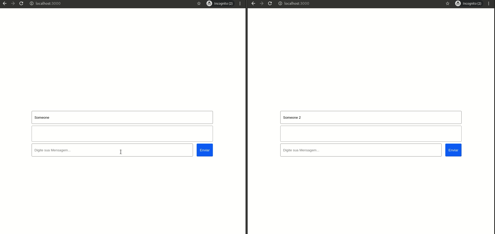

# Chat Frontend made in react



---

## Getting started

- Clone the [Chat Backend](https://github.com/arthurguedes375/Chat-Node-Backend) and do that getting started
- After clone this repository

- Run this commands in the repository folder
```
yarn && yarn start
```


<p align="center">Made with :heart: <strong>Arthur Guedes</strong></p>